# Savo SiteScout — Architecture

> Expansion intelligence for Savomart Chennai: **which area → which property → is the catchment right?**
> This document is the source of truth for how the system is built and *why*. The README summarises it.

| | |
|---|---|
| Status | Final design, v1.0 (28 Sep 2026) |
| Scope | M1 Area Intelligence · M2 Property Scouting · M3 Catchment Study · Bonus: city-wide opportunity map, offline field capture |
| Region | Greater Chennai / Chennai Metropolitan Area (bbox ≈ 12.75–13.35 N, 79.95–80.35 E) |

---

## 1. Goals, constraints, principles

**Goals**
1. One loop shared by four personas: **BD Manager (BDM)**, **BD Executive (BDE)**, **Survey Manager (SM)**, **Survey Executive (SE)**.
2. Every number the user sees must be **traceable** to a dataset, an as-of date and a formula.
3. Field flows (BDE, SE) are **phone-first** and **survive weak networks**.

**Constraints**
- ~35 build hours · Python (FastAPI) · React (TSX) · brand colours `#782B90` / `#FFF200` · real Chennai geography.
- Only OSM + Indian open data + the Savomart Stores API. Where there is no public data (e.g. rent), mock data is **labelled MOCK** in the UI and the DB.
- LLM provider swappable via config. No keys in git.

**Principles**
- **Rules compute, the LLM explains.** Scores are deterministic arithmetic. The LLM only narrates facts we pass it, and a validator enforces that.
- **Precompute once, query fast.** City-wide H3 features are built at ingest time, so an area report takes seconds.
- **Everything is an event.** Pipeline moves, study reuse decisions and re-evaluations are all recorded with who, what, why and when.
- **Boring infrastructure.** One Postgres does everything (spatial, app data, job queue). No Redis, no Spark.

---

## 2. System context

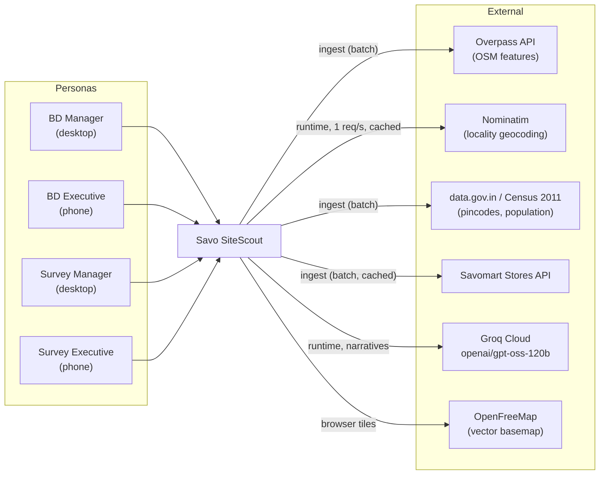

---

## 3. Container architecture

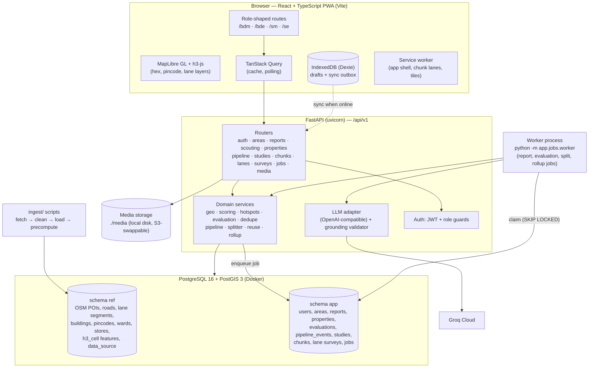

| Container | Responsibility | Runs as |
|---|---|---|
| **Web (PWA)** | Persona UIs, map interaction, offline drafts and sync | `npm run dev` (Vite) or a static build |
| **API** | Validation, auth, synchronous queries, enqueuing jobs | `uvicorn app.main:app` |
| **Worker** | Long or fallible work: area reports, property evaluations, study split, roll-up, LLM calls | `python -m app.jobs.worker` (same codebase as API) |
| **PostgreSQL + PostGIS** | System of record, spatial engine, job queue | `postgis/postgis:16-3.4` in Docker |
| **Ingest** | One-off / refreshable data pipeline | `python -m ingest.run_all` |

---

## 4. Tech stack

| Layer | Choice | Why |
|---|---|---|
| Backend | **FastAPI**, Pydantic v2, SQLAlchemy 2, **GeoAlchemy2**, Alembic, psycopg 3 | Typed request/response models, auto OpenAPI docs at `/docs`, mature spatial ORM support |
| Database | **PostgreSQL 16 + PostGIS 3.4** (Docker) | Spatial SQL (`ST_DWithin`, `ST_Intersects`, GiST indexes) plus ACID transactions plus a job queue, all in one system |
| Spatial grid | **H3** (`h3` Python, `h3-js` in the browser) | Uniform hexagons for city-wide scoring, percentiles, hotspots and grid-cell selection |
| Geometry | Shapely 2, pyproj, networkx | Lane graph and region-growing splitter |
| Background jobs | **Postgres job table** + worker (`FOR UPDATE SKIP LOCKED`) | Durable, retryable, step-level progress, no extra infrastructure |
| LLM | **Groq Cloud**, `openai/gpt-oss-120b`, through the `openai` SDK with a configurable `base_url` | OpenAI-compatible, so Groq, OpenAI or a local Ollama is a `.env` change. JSON mode for structured output |
| Auth | Seeded users, JWT (PyJWT), bcrypt | Enough for real role-based access control without building an auth product |
| Frontend | **React 18 + TypeScript + Vite**, React Router, **TanStack Query** | Fast dev loop. Query handles polling, caching and retries |
| Map | **MapLibre GL** via `react-map-gl`, **OpenFreeMap** vector tiles | Free, no API key, handles GeoJSON and hex layers well |
| UI | **Tailwind CSS + shadcn/ui** (Radix), lucide icons, Recharts | Accessible primitives, brand tokens in one place, charts for compare |
| Forms | react-hook-form + zod | The same validation rules on phone and desktop |
| Offline | **vite-plugin-pwa** (Workbox) + **Dexie** | Installable app, cached lanes, durable outbox |
| Tests / CI | pytest (+ testcontainers PostGIS), Vitest, GitHub Actions | Covers scoring, splitter, reuse, grounding and pipeline transitions |

**Rejected: Apache Sedona.** It's a distributed analytics engine on Spark, not a transactional store. We need transactions, row locks for the job queue, unique constraints for idempotent sync and millisecond per-request queries. Our data is small (Chennai: ~10⁵ POIs, ~10⁵–10⁶ buildings). Sedona is the right tool to *batch-precompute H3 features for all of India*; see §15.

---

## 5. Repository layout

```
savomart-fullstack-hackathon-2026/
├── docker-compose.yml          # postgis (+ optional api, worker, web)
├── .env.example                # DATABASE_URL, LLM_*, JWT_SECRET, STORES_API_*
├── backend/
│   ├── app/
│   │   ├── main.py             # FastAPI app, routers, error handlers
│   │   ├── core/               # config (pydantic-settings), db session, security, errors
│   │   ├── models/             # SQLAlchemy + GeoAlchemy2 models (ref.*, app.*)
│   │   ├── schemas/            # Pydantic request/response DTOs
│   │   ├── api/v1/             # routers, one per resource
│   │   ├── services/           # geo, scoring, hotspots, evaluation, dedupe, pipeline,
│   │   │                       # splitter, reuse, rollup
│   │   ├── llm/                # provider.py, prompts/, grounding.py, cache
│   │   ├── jobs/               # queue.py (enqueue/claim), worker.py, tasks/*.py
│   │   └── storage/            # media storage interface (local disk impl)
│   ├── alembic/                # migrations
│   ├── scripts/seed.py         # personas, demo areas, properties, a completed study
│   └── tests/
├── ingest/
│   ├── config/categories.yaml  # OSM tag → SiteScout category/weight, competitor brand regexes
│   ├── fetch_osm.py            # tiled Overpass queries → data/raw/osm/*.json
│   ├── fetch_pincodes.py       # OGD pincode boundaries + post-office directory
│   ├── fetch_census.py         # Census 2011 ward/town population & households
│   ├── fetch_stores.py         # Savomart Stores API → data/raw/stores.json (snapshot)
│   ├── clean_load.py           # normalise, dedupe, classify, COPY into ref.*
│   ├── build_lanes.py          # split OSM ways at intersections → ref.lane_segment
│   ├── precompute_h3.py        # ref.h3_cell features + city percentiles
│   └── run_all.py
├── frontend/
│   └── src/
│       ├── app/                # providers, router, theme (brand tokens)
│       ├── routes/{bdm,bde,sm,se,auth}/
│       ├── components/         # shared UI (ScoreCard, StageBadge, ProvenanceChip…)
│       ├── map/                # MapView, layers (hex, pincode, lanes, stores, POIs)
│       ├── api/                # typed client + TanStack Query hooks
│       └── offline/            # Dexie db, outbox, sync engine
├── data/                       # raw/ is gitignored; small processed seeds committed
├── docs/ARCHITECTURE.md
└── ai-sessions/
```

---

## 6. Data architecture

### 6.1 Ingestion pipeline

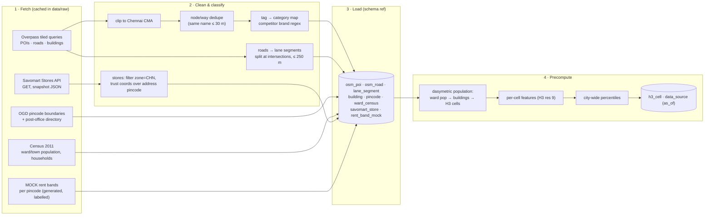

**Data sources and how each is used**

| Source | Used for | Processing | As-of |
|---|---|---|---|
| OSM via Overpass (tiled 0.05° over the CMA bbox) | POIs (shops, supermarkets, schools, hospitals, offices, transit, worship), roads, buildings | Category mapping from `categories.yaml`; organised-competitor detection via `brand`/`name` regex (Reliance Fresh/Smart, More, Nilgiris, DMart, Spencer's, Star Bazaar, Ratnadeep…); node/way dedupe | Download timestamp |
| OGD pincode boundaries (GeoJSON) | Pincode selection, report labels | Filter to CMA bbox, `ST_MakeValid`, multipolygons | Dataset date |
| OGD pincode directory | Locality search fallback, pincode ↔ locality names | Filter TN / Chennai districts | Dataset date |
| Census 2011 (Primary Census Abstract) | Population, households | Join to ward/town polygons. **Dasymetric split**: ward population allocated to H3 cells in proportion to residential building footprint area | 2011 (shown as such, with an "aged data" note) |
| Savomart Stores API | Nearest-store distance, cannibalisation, network gap | `zone == "CHN"` (11 stores), geometry from `geocoordinates`. Address pincodes ignored (found wrong, e.g. Thiruvanmiyur listed as 600068) | Fetch time |
| Nominatim (runtime) | "Search locality" → polygon/point | 1 req/s, custom User-Agent, results cached in `app.geocode_cache` | Query time |
| **MOCK** rent bands | Rent sanity check in property evaluation | Generated per pincode from a zone tier (central / inner / outer), with `is_mock = true` | Always labelled MOCK |

Every loaded dataset writes a row to `ref.data_source(key, name, url, license, as_of, fetched_at, is_mock, row_count)`. Reports store the **ids of the data sources they used**, so a report from 29 Sep stays reproducible after data is refreshed.

### 6.2 The H3 feature grid

- **Resolution 9** (~0.105 km² per cell, edge ≈ 174 m) is the analysis unit. **Resolution 8** (~0.74 km²) is the *clickable* grid-cell unit on the map.
- `ref.h3_cell` has one row per res-9 cell in the CMA (~50k cells):

| Feature | Definition |
|---|---|
| `pop_est`, `hh_est` | Dasymetric population and households |
| `res_bldg_area_m2`, `res_bldg_count` | OSM buildings in residential landuse or tagged residential/apartments/house |
| `footfall_pts` | Weighted count: school 3, college 4, hospital 4, clinic 1, office 1, bus stop 1, rail/metro station 6, worship 1, market 3 |
| `grocery_comp` | Organised supermarket chains (weight 3) + supermarkets (2) + convenience/greengrocer/kirana (1) |
| `road_m_by_class` | Metres of road by class (primary → residential) |
| `nearest_store_m`, `nearest_store_code` | Straight-line distance to the nearest Savomart store |

- Percentiles are precomputed across all inhabited cells, so a score of "82" literally means *better than 82% of Chennai*.

### 6.3 Data model

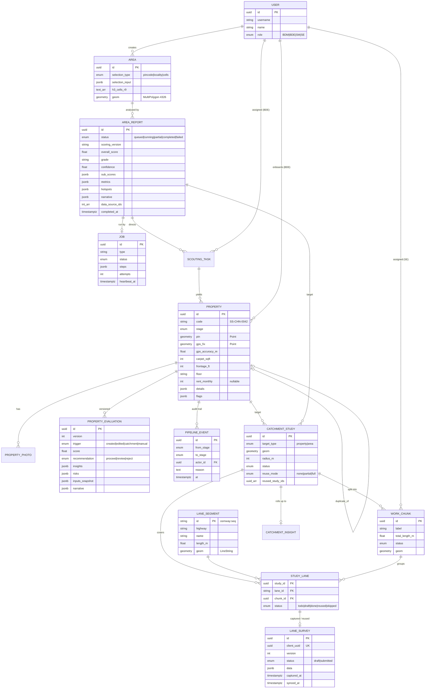

Key design notes:
- **`ref` vs `app` schemas.** Reference data can be dropped and re-ingested without touching user data.
- **Lane segments are stable reference entities** (`osm_way_id:seq`). That makes *lane-level reuse* across studies an exact join rather than a fuzzy geometry match.
- **Evaluations are append-only versions.** The property card shows the latest one and the change from the previous one.
- `PIPELINE_EVENT` is insert-only, and `property.stage` is updated **in the same transaction**, so the audit trail can't drift from the current state.
- Spatial indexes: GiST on every `geom`. B-tree on `h3` and `property.stage`. Partial index on `job(status) WHERE status='queued'`.

---

## 7. Personas → views → permissions

| Capability | BDM | BDE | SM | SE |
|---|:-:|:-:|:-:|:-:|
| Explore map, run / compare area reports | ✅ | view hotspots of own tasks | view | – |
| Create scouting tasks (direct executives) | ✅ | – | – | – |
| Onboard / edit property | view all | ✅ own | – | – |
| Move pipeline stage | ✅ | limited: submit, log site visit | – | – |
| Request catchment study | ✅ | – | – | – |
| Plan / split / assign study | view progress | – | ✅ | – |
| Capture lane surveys | – | – | view | ✅ own chunks |

Enforcement happens in two layers: `require_role(...)` FastAPI dependencies on routes, plus **row-level ownership checks** in services (a BDE only sees their own properties and tasks; an SE only their own chunks). The frontend hides what the backend forbids; it doesn't grant anything.

**Demo login:** a persona picker with seeded users: 1 BDM, 2 BDEs, 1 SM, 3 SEs (so assignment is real). A "Switch persona" menu in the header re-logs in as another seeded user.

| Persona | Primary screens |
|---|---|
| **BDM** (desktop) | *Explore* (map + selection modes + city opportunity heatmap) · *Reports* (list, detail, compare side by side) · *Pipeline* (kanban by stage, 30-second decision card) · *Studies* (request, track) |
| **BDE** (phone) | *My tasks* (map of assigned hotspots, directions link) · *Add property* (3-step wizard: pin → details → photos) · *My properties* (status, manager feedback) |
| **SM** (desktop) | *Inbox* (incoming requests with reuse verdict) · *Plan* (map of chunks, rebalance, assign) · *Progress* (per-chunk / per-SE completion, stale drafts) |
| **SE** (phone) | *My assignments* · *Chunk map* (lanes coloured by status) · *Lane form* (offline-capable) |

---

## 8. M1 — Area Intelligence

### 8.1 Selection → area

| Mode | How |
|---|---|
| Pincode | Pick from a searchable list or click a pincode polygon → `ref.pincode.geom` |
| Locality | Nominatim search limited to the CMA viewbox → returned polygon, or a 1.2 km buffer around the point if Nominatim returns only a point |
| Grid cells | Click or drag-select res-8 hexes on the map (h3-js renders them client-side) → union |

Every mode resolves to **polygon → covering set of res-9 cells** (`h3.polygon_to_cells`). The rest of the pipeline doesn't care how the area was picked.

### 8.2 Report job flow

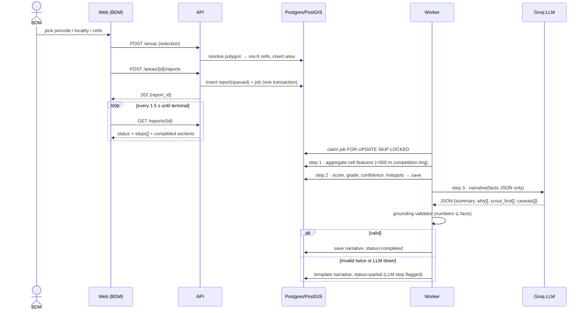

**What the user sees while it runs:** a step list (Gathering data ✓ → Scoring ✓ → Writing summary …). Sections render as soon as their step completes; **scores appear before the narrative**. On failure, completed sections stay visible, the failed step shows its error, and **Retry** resumes from that step, because step outputs are persisted.

### 8.3 Scoring model (`scoring_version = "v1"`)

Area metrics are **densities** (per km² or per 10k people), so big and small areas compare fairly. Each metric becomes a 0–100 sub-score by **city percentile**.

| Sub-score | Weight | Metric | Direction |
|---|:-:|---|---|
| Demand | 25% | Estimated population per km² | higher is better |
| Residential fabric | 15% | Residential building footprint share | higher is better |
| Footfall generators | 15% | Weighted footfall points per km² | higher is better |
| Competition | 20% | Grocery competition per 10k people (area + 500 m ring), organised chains ×3 | **lower is better** |
| Savomart network fit | 15% | Distance from area centroid to the nearest Savomart store | band curve: < 1.5 km = cannibalisation penalty, 1.5–6 km = best (supply-chain synergy), > 10 km = logistics penalty |
| Access | 10% | Primary/secondary/tertiary road metres per km² + residential lane density | higher is better |

- **Overall** = Σ weight × sub-score → **Grade**: A ≥ 75, B ≥ 60, C ≥ 45, D < 45.
- **Confidence** (High/Med/Low) is derived from data coverage: OSM building completeness in the area, census vintage, and how many cells have zero POIs (a sign of unmapped rather than empty). It's shown next to the grade.
- **Explainability UI:** each sub-score card shows `raw value → percentile → weight → contribution`, with a provenance chip (`OSM · fetched 28 Sep 2026`). Clicking a card highlights the driving features on the map.
- Weights live in versioned config. A report records the version it used, so old reports never silently change.

### 8.4 "Scout here first" hotspots

1. Score every res-9 cell in the area with the same model (cell-level percentiles).
2. Keep cells with at least a minimum population (not lakes, not industrial land).
3. Greedily pick the top cells with **≥ 2-ring spacing** (≈ 600 m apart), up to 5.
4. For each, attach reason codes (e.g. `HIGH_DEMAND`, `LOW_COMPETITION`, `NEAR_TRANSIT`), the nearest named main road, and the nearest Savomart store distance.

These hotspots are what the BDM turns into **scouting tasks** for BDEs.

### 8.5 Compare & history

- Reports are immutable snapshots with `completed_at` and the list of `data_source` rows (with as-of dates) they used.
- **Compare** puts 2–4 reports side by side: a radar chart of sub-scores, a metric table with the best value highlighted, and a note if the reports used different data versions.

---

## 9. M2 — Property Scouting & Evaluation

### 9.1 Onboarding (BDE, phone)

Three-step wizard, drafts saved to IndexedDB after every change:
1. **Pin:** starts at the GPS fix and can be dragged. The GPS accuracy is recorded.
2. **Details:** property type (shop / showroom / ground-floor commercial / standalone), carpet area (sqft), frontage (ft), floor, rent/month, deposit, lease term, parking (2W/4W), power load (kW), delivery vehicle access, visibility from the main road, landlord contact (optional), notes.
3. **Photos:** front, interior, street view in both directions. Compressed on the device to ≤ 1600 px, uploaded separately and retryable.

### 9.2 Bad input handling

| Problem | Detection | Response |
|---|---|---|
| Wrong pin | Pin more than 150 m from the GPS fix, or pin on a road/water/non-built area | `PIN_GPS_MISMATCH` flag. The BDE confirms or fixes it, and the BDM sees the flag |
| Missing rent | `rent_monthly` is null | Evaluation is marked *incomplete*. The rent check uses the **MOCK** band and says so. The BDM can request the rent |
| Rent outlier | Rent/sqft outside [0.5×, 2×] of the pincode MOCK band | `RENT_OUTLIER` risk |
| Duplicate | `ST_DWithin(pin, 50 m)` + name/landmark trigram similarity > 0.4 | Warning **before** submit with an "is this the same place?" choice; `duplicate_of` link if confirmed |
| Out of region | Pin outside the CMA polygon | Hard reject with a message |

### 9.3 Automatic evaluation

Runs as a worker job on submit, on edit, and **when a linked catchment study completes**.

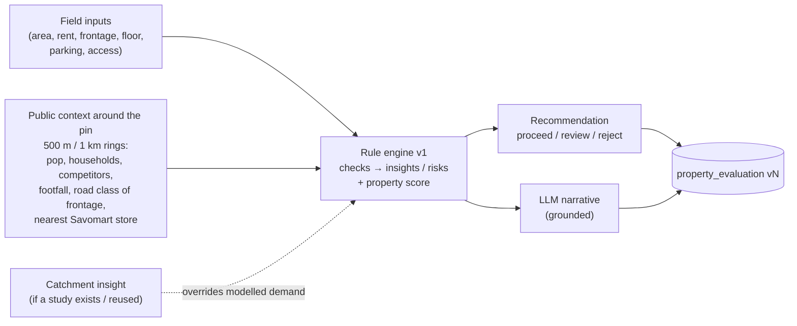

**Property score** = 60% *location* (the area model applied to the 1 km ring) + 40% *site* (size fit to the 1,500–4,000 sqft target, ground floor, frontage ≥ 20 ft, parking, delivery access, rent vs band).

**Recommendation rules:** `reject` if there is any blocker (e.g. < 800 sqft, < 800 m from an existing Savomart store, no vehicle access). `proceed` if score ≥ 65 and no high risks. Otherwise `review`.

**The 30-second decision card (BDM):** photo strip · score dial with the change since the last version · recommendation pill · top 3 insights · top 3 risks · rent vs band (MOCK badge) · mini-map with 1 km ring, competitors and the nearest Savomart store · stage and "last action by X, 2 h ago" · action buttons.

### 9.4 Pipeline (state machine)

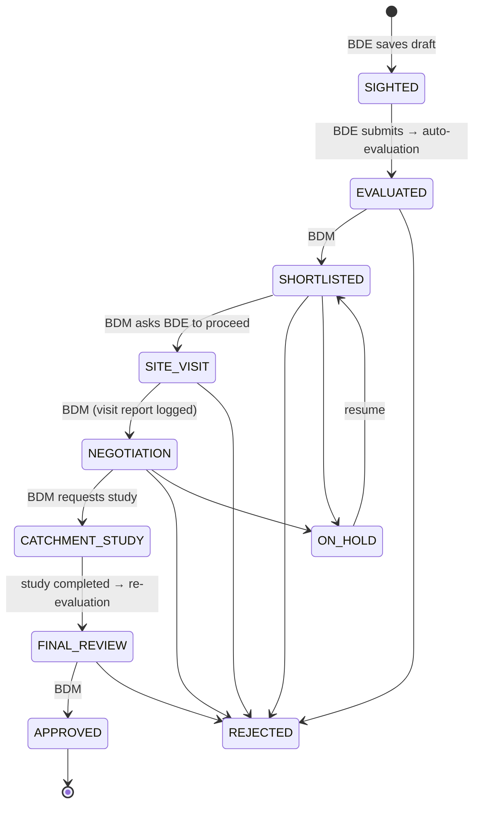

- Transitions are a **declarative table** (`from`, `to`, allowed roles, required fields). **Reject and hold require a reason**; site visit requires an assignee.
- Each move → `pipeline_event` (actor, from → to, reason, timestamp) + a notification to the affected persona.
- Reaching `CATCHMENT_STUDY` creates a study request (§10). When the study completes, the property is re-evaluated automatically and moves to `FINAL_REVIEW`.

**Should the evaluation change when new data arrives?** Yes, but visibly. A new evaluation version is created with `trigger = catchment`, and the card shows "Score 64 → 71: surveyed households 2,340 vs modelled 1,810". Old versions stay viewable.

---

## 10. M3 — Catchment Study

### 10.1 Lifecycle

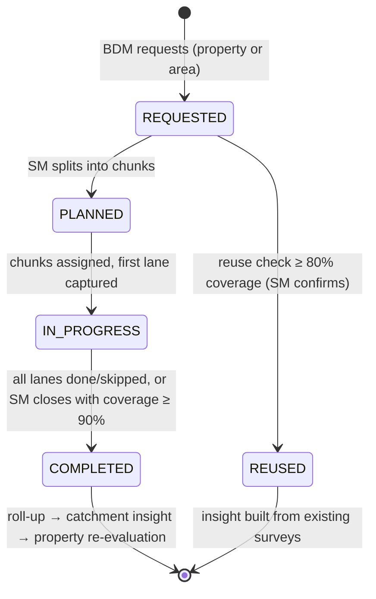

### 10.2 Catchment geometry and lanes

- **Property target:** an 800 m buffer (≈ a 10-minute walk, the normal draw for a neighbourhood grocery store). **Area target:** the area polygon itself.
- **Lanes** = `ref.lane_segment` rows intersecting the catchment, filtered to `residential | living_street | unclassified | service | tertiary | pedestrian`. Arterials are excluded because they aren't surveyed door to door. Segments are pre-split at intersections to ≤ 250 m, so a lane is a walkable unit.

### 10.3 Reuse decision (runs on every new request)

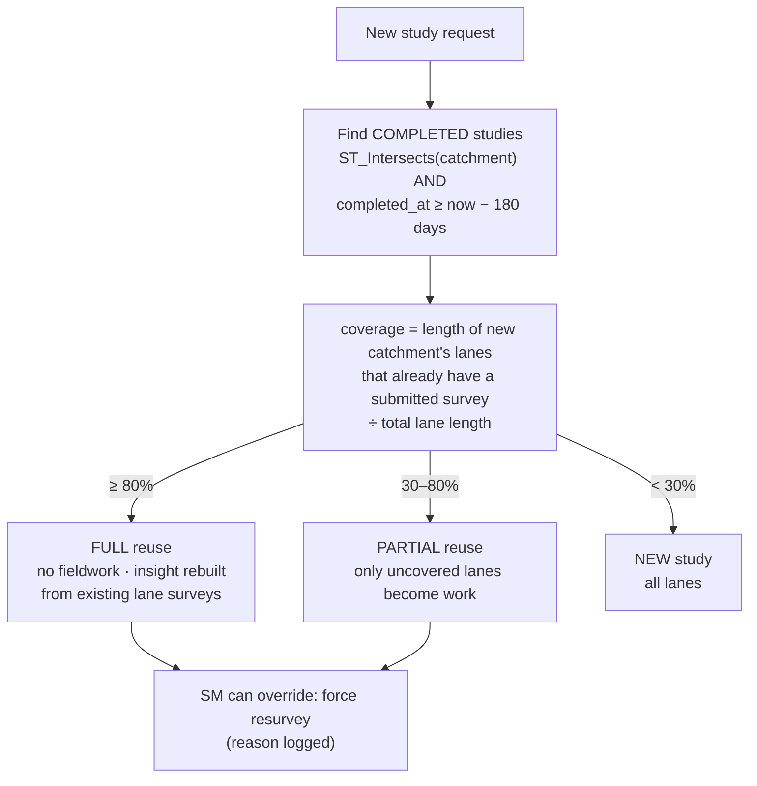

- **"Close enough"** is measured on the **actual lanes**, not the distance between centroids. Two studies 900 m apart can still share 60% of their lanes, and that's what matters.
- **"Fresh enough"** is 180 days by default (configurable). Lanes surveyed 90–180 days ago are reused but marked *ageing* in the insight. The insight records `reused_study_ids`, and each lane shows which study it came from.

### 10.4 Splitting into fair, non-overlapping chunks

The goal is chunks of roughly equal **walking effort**, each one **contiguous** so a surveyor doesn't criss-cross the area, with **every lane in exactly one chunk**.

```
effort(lane) = length_m × (1.5 if highway in {tertiary, unclassified} else 1.0)
k = ceil(total_effort / TARGET_EFFORT)          # TARGET ≈ 2.5 km ≈ one surveyor-day
1. Build lane adjacency graph G (lanes sharing an endpoint).
2. Pick k seeds by farthest-point sampling over lane centroids.
3. Region-grow: repeatedly take the chunk with the SMALLEST current effort and
   add its adjacent unassigned lane with the least added distance to that chunk's seed.
4. Disconnected leftovers → attach to the nearest chunk by centroid distance.
5. Rebalance pass: move boundary lanes from the heaviest to the lightest neighbouring chunk
   while it reduces the max/min effort ratio (stop at ≤ 1.25 or 50 iterations).
```

Non-overlap is guaranteed because assignment is a partition of the lane set. The SM sees chunks as coloured groups on the map with their effort. They can re-run the split with a different target, drag a lane between chunks, and assign an SE to each chunk (showing that SE's current load).

### 10.5 What an SE captures per lane

| Field | Type | Why it matters |
|---|---|---|
| Dominant housing type | independent / apartments / mixed / informal / commercial | Demand profile |
| Dwelling estimate | count bucket (0–10, 11–25, 26–50, 51–100, 100+) or exact | **Surveyed households** replace the modelled estimate |
| Building condition | new / maintained / old / dilapidated | Income proxy |
| Vehicle mix | mostly 2W / mixed / many cars | Income proxy, basket size |
| Kirana / grocery shops on the lane | count + names + "organised chain?" | Ground-truth competition (OSM underestimates kiranas) |
| Footfall at capture time | low / medium / high + time of day | Activity |
| Delivery vehicle access | yes / 2W only / no | Operations |
| Photos (optional), notes | | Evidence |
| Auto: GPS point, captured_at, device id | | Audit, pin sanity |

The form is designed for one-handed use: big tap targets, the first four fields are chip toggles, and a lane can be completed in about 30 seconds. Lanes can be marked **skipped** with a reason (gated, under construction, not residential).

### 10.6 Weak network: what happens to a half-filled survey

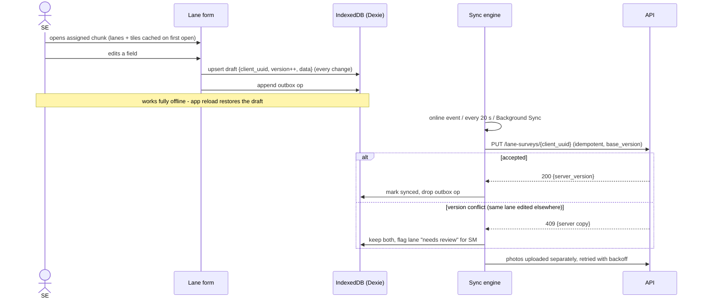

- A half-filled survey is a **draft**. It's never lost, since it persists locally and syncs to the server as `status=draft`. The SM sees it as "in progress (draft, last sync 14:05)".
- The header shows a sync badge ("3 lanes waiting to sync"). Submitting offline is allowed; it syncs later.
- IDs are created on the device (`client_uuid`) and every write is an idempotent PUT, so retries can't create duplicates.

### 10.7 Roll-up → catchment insight

This runs when a study completes, or on demand for a progress preview:
- Surveyed households (sum of dwelling estimates, bucket midpoints) and **the change against the modelled estimate**
- Housing mix, income-proxy index (condition × vehicle mix), and surveyed competitor count vs OSM competitor count
- Coverage % and share of reused lanes
- Grounded LLM narrative: "what the ground says"

The insight is linked to the property or area. Property targets trigger re-evaluation v(n+1), and area targets get a "ground-truthed" badge on their reports.

---

## 11. AI integration & grounding

**Where AI adds value:** turning 30 numbers into a 5-line argument a BDM can read quickly, comparing areas in plain language, and summarising lane notes. **It never produces a data point.**

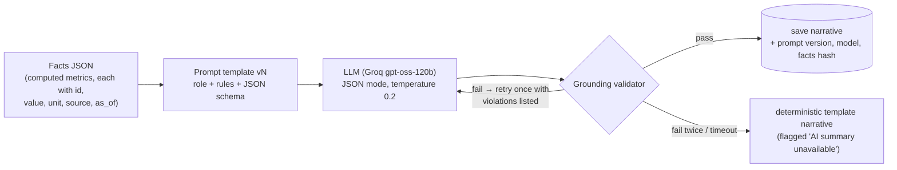

**Grounding rules, enforced in code (`llm/grounding.py`):**
1. The prompt contains **only** precomputed facts. The model is told to cite each claim with `[fact_id]`.
2. The output schema is fixed: `{summary, reasons:[{text, fact_ids[]}], scout_first:[{hotspot_id, text}], risks:[…], caveats:[…]}`.
3. The validator extracts every number in the output (including "2.3k", "45%", "1.2 km") and checks it against fact values within rounding tolerance. Any number not found is a violation. Every `fact_id` and `hotspot_id` must exist.
4. The UI renders `[fact_id]` citations as hoverable chips showing value, source and as-of date.
5. Calls are cached by `sha256(prompt_version + facts)`, so the same inputs give the same narrative and no repeat call to Groq.

**Provider abstraction:**

```python
class LLMProvider(Protocol):
    def complete_json(self, system: str, user: str, schema: dict) -> dict: ...

# .env
LLM_BASE_URL=https://api.groq.com/openai/v1
LLM_MODEL=openai/gpt-oss-120b
LLM_API_KEY=...            # never committed
LLM_TIMEOUT_S=30
```

One `OpenAICompatibleProvider` covers Groq, OpenAI and Ollama. A `NullProvider` (template-only) is used in tests and when no key is set, so the app still runs without an LLM.

---

## 12. Background processing

| Job type | Triggered by | Steps |
|---|---|---|
| `area_report` | BDM run | aggregate → score + hotspots → narrative |
| `property_eval` | submit / edit / study completion | context → rules → narrative |
| `study_plan` | SM "split" | lanes → reuse check → split |
| `study_rollup` | study completion | aggregate → insight narrative → trigger `property_eval` |

- **Queue:** `app.job` rows. Workers claim with `UPDATE … WHERE id = (SELECT id FROM app.job WHERE status='queued' AND run_after <= now() ORDER BY created_at FOR UPDATE SKIP LOCKED LIMIT 1)`.
- **Steps are idempotent and checkpointed.** Each step writes its output to the domain row (e.g. `area_report.sub_scores`) and marks `job.steps[i].status`. A retry skips finished steps.
- **Heartbeat** every 10 s. A reaper re-queues `running` jobs with a heartbeat older than 2 min. Retries are capped at 3, with exponential `run_after` backoff.
- **Terminal states:** `completed`, `partial` (core output present, optional step such as the LLM failed), `failed` (with an error message the user can read).
- The UI polls with TanStack Query `refetchInterval`, which stops at a terminal state. Server-Sent Events are a later option.

---

## 13. API surface (v1)

| Area | Endpoints |
|---|---|
| Auth | `POST /auth/login` · `GET /auth/me` · `GET /auth/personas` (demo picker) |
| Reference | `GET /ref/pincodes?q=` · `GET /ref/localities?q=` (Nominatim, cached) · `GET /ref/stores` · `GET /ref/opportunity?bbox=` (city heatmap, res-8) · `GET /ref/data-sources` |
| M1 | `POST /areas` · `GET /areas/{id}` · `POST /areas/{id}/reports` · `GET /reports` · `GET /reports/{id}` · `POST /reports/{id}/retry` · `GET /reports/compare?ids=` |
| Scouting | `POST /scouting-tasks` · `GET /scouting-tasks?mine=1` · `PATCH /scouting-tasks/{id}` |
| M2 | `POST /properties/check-duplicate` · `POST /properties` · `PATCH /properties/{id}` · `GET /properties?stage=` · `GET /properties/{id}` · `POST /properties/{id}/photos` · `GET /properties/{id}/evaluations` · `POST /properties/{id}/transitions` · `GET /properties/{id}/events` |
| M3 | `POST /studies` · `GET /studies?status=` · `GET /studies/{id}` · `POST /studies/{id}/plan` · `PATCH /chunks/{id}` (assign/rename) · `POST /studies/{id}/lanes/{lane_id}/move` · `GET /chunks?mine=1` · `GET /chunks/{id}/lanes` (GeoJSON) · `PUT /lane-surveys/{client_uuid}` · `POST /studies/{id}/complete` · `GET /studies/{id}/insight` |
| Jobs / media | `GET /jobs/{id}` · `GET /media/{path}` |

Conventions: GeoJSON for geometries (EPSG:4326). Errors use `{error: {code, message, details}}` (RFC 7807-style) with stable codes such as `PIPELINE_TRANSITION_NOT_ALLOWED` and `DUPLICATE_SUSPECTED`. Lists are paginated. All times are UTC in the API and shown in IST.

---

## 14. Cross-cutting concerns

| Concern | Approach |
|---|---|
| **Brand** | Purple `#782B90` for primary actions, header and selected state; yellow `#FFF200` for highlights, hotspots and the "scout here" pins, always on purple or dark to keep contrast (never yellow text on white). Tokens are defined once in Tailwind config |
| **Mock data honesty** | `is_mock` on data sources. A yellow **MOCK** badge wherever mock rent appears |
| **Loading / empty / error states** | Skeletons for cards, step progress for jobs, an empty state with a clear next action for each list, and toasts with retry for mutations |
| **Mobile** | BDE and SE routes are designed for 360 px width first, with bottom tab navigation, thumb-reachable actions and a camera `capture` input |
| **Observability** | Structured JSON logs (request id, user, job id), LLM call log (model, tokens, latency, validator result) |
| **Security** | JWT with a short lifetime, role + ownership checks, upload type/size limits, secrets only in `.env`, CORS locked to the web origin |
| **Testing** | Unit: scoring math, hotspot spacing, splitter (partition, contiguity, balance), reuse thresholds, grounding validator, pipeline transition table. Integration: API against PostGIS in testcontainers. CI: GitHub Actions (lint + tests) |

---

## 15. Key decisions & trade-offs

| # | Decision | Alternatives | Why |
|---|---|---|---|
| D1 | **PostGIS** as the only datastore | Apache Sedona, MongoDB geo, SpatiaLite | Transactions + spatial SQL + queue in one place. The data fits easily. Sedona fits a future national-scale batch precompute, not serving the app |
| D2 | **H3 precompute** at ingest | Live Overpass queries per report | Reports take seconds instead of minutes, city percentiles make scores meaningful, and the opportunity heatmap comes almost free. Cost: data is as fresh as the last ingest (shown on every report) |
| D3 | **Postgres job queue** | Celery + Redis, FastAPI BackgroundTasks | Durable and retryable with no extra infrastructure. BackgroundTasks die with the process and have no retries |
| D4 | **Rule-based scoring + LLM narration** | LLM rates the area | Deterministic, testable, explainable. The LLM can't invent numbers because it never produces them, and the validator proves it |
| D5 | **Dasymetric population from Census 2011** | Ward totals only; WorldPop | Stays within the allowed sources and gives sub-ward resolution. Aged data is flagged, and surveys override it |
| D6 | **Lane-level reuse** | Radius/centroid distance rule | Measures actual overlap of work; enables *partial* reuse |
| D7 | **Region-growing splitter** on the lane graph | k-means on centroids, grid cells | Guarantees contiguity (walkable routes) and a partition (no overlap), balanced by effort |
| D8 | **PWA + IndexedDB outbox** | Native app | One codebase and installable. Offline is enough for lane capture |
| D9 | **Straight-line distances** | OSRM drive times | Keeps the build within the timeline. Shown as "straight-line"; OSRM is the first upgrade |
| D10 | **Seeded users + persona switcher** | Full auth / SSO | The brief says not to spend time on auth. RBAC is still enforced server-side |

**Deliberately out of scope:** real rent data (none is public), OSRM isochrones, native apps, multi-city support, notification delivery beyond the in-app feed.

---

## 16. Risks & mitigations

| Risk | Impact | Mitigation |
|---|---|---|
| Overpass rate limits / timeouts on building data | Ingest stalls | Tiled queries + raw cache + resumable; fallback to the Geofabrik Southern Zone PBF clipped with osmium |
| Census ward polygons don't match 2011 ward numbering | Weak population layer | Fall back to town/district totals spread by building area; lower confidence shown |
| OSM under-maps kiranas and buildings in some areas | Competition / demand skew | Confidence indicator; lane surveys capture ground-truth competition |
| Groq rate limits or outage | No narrative | Cache + template fallback, `partial` status; scores are unaffected |
| Time | Loop incomplete | Build order M1 → M2 → M3 with a demoable commit after each; bonuses only after M3 |

---

## 17. Deployment

- **Local (primary):** `docker compose up -d db` → `alembic upgrade head` → `python -m ingest.run_all` (or load the committed seed snapshot) → `python scripts/seed.py` → run the API, worker and `npm run dev`.
- **Optional hosted:** web on Vercel. API + worker on Render/Railway. Postgres + PostGIS on Neon or Supabase (both support PostGIS). Media on S3-compatible storage through the storage interface.

---

## 18. Build plan

| Block | Deliverable | Commit |
|---|---|---|
| 1 | Scaffold: compose, FastAPI skeleton, Alembic, auth + personas, Vite TSX shell, brand theme, map | `chore: scaffold` |
| 2 | Ingest: OSM, pincodes, census, stores, lanes, H3 precompute | `feat(data): …` |
| 3 | M1: selection, jobs, scoring, hotspots, LLM + validator, compare | `feat(m1): …` |
| 4 | M2: scouting tasks, onboarding wizard, dedupe, evaluation, pipeline + events | `feat(m2): …` |
| 5 | M3: requests, reuse, splitter, assignment, SE offline capture, roll-up, re-evaluation | `feat(m3): …` |
| 6 | Opportunity map, tests + CI, polish, README, video | `docs/test: …` |
